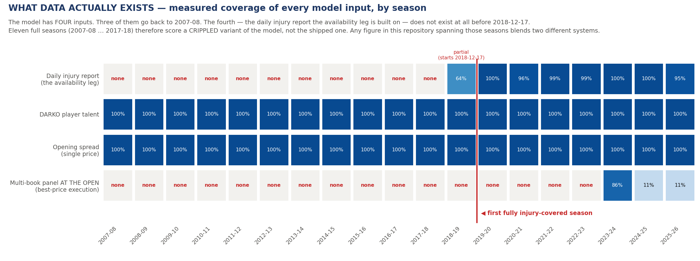
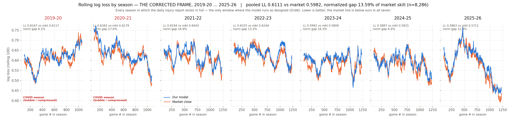
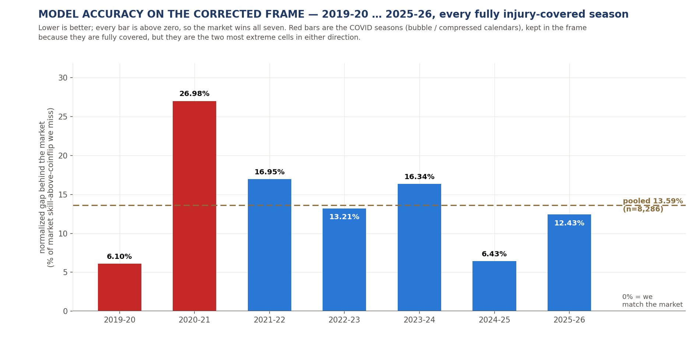

# NBA Prediction Model

A market-blind NBA win-probability model, and the full research record behind
it: **a register that runs to D188, most entries rejections.**

---

## ⚠️ Read this before any number: the data is severely limited before 2019

**The model has four inputs. One of them — the daily NBA injury report the entire
availability leg is built on — did not exist before 2018-12-17.**



| | |
|---|---|
| Seasons with **zero** injury-report coverage | **11** (2007-08 … 2017-18) |
| First season with partial coverage | 2018-19, at **63.7%** (report series starts mid-season, 2018-12-17) |
| First **fully covered** season | **2019-20** |
| Fully covered seasons available | **7** (2019-20 → 2025-26) |
| Seasons with a **measured multi-book price** at the open | **1** (2023-24) |

**What this means, stated bluntly:**

1. **Every figure in this repository that spans seasons before 2019-20 —
   including all 14-season and 19-season results — is measuring a *different,
   crippled model*,** not the one that would be deployed. Before the feed exists
   the availability leg runs on inputs it was never designed to have. Those
   numbers are historical context, not a description of the shipped system.
2. **The honest evaluation frame is 2019-20 → 2025-26. That is seven seasons.**
   It is not a lot. Season-clustered confidence intervals on this frame are tens
   of ROI points wide, and essentially everything we have tested on it is
   statistically indistinguishable from noise.
3. **The frame is too short to tune on.** Measured directly (`D187`): on this
   frame a null that takes the best of five *randomly chosen* game subsets buys
   **+2.54 ROI points on average**. Every strategy filter we tested lands inside
   that band. Correctness of frame and ability to optimise are in direct
   tension, and we chose correctness.
4. **Multi-book execution is largely counterfactual.** The headline execution
   tier assumes best-of-9 books at the open. That panel genuinely exists for
   **2023-24 only** (7.74 books/game). 2024-25 and 2025-26 observe 1.00 and 1.03
   books/game; their multi-book price is a modelled uplift, not an observation.

Every document in `docs/` carries this caveat in its header. If you quote a
number from this repository, quote its frame with it.

---

The model is the smaller half of this repository. The larger half is
`docs/DECISIONS.md` — an append-only register in which every experiment was
pre-registered, gated out-of-sample, and written down whether it worked or not.
Several of the most useful entries document mistakes we made and caught,
including two frames that were wrong and had to be corrected in public.

---

## The two reporting frames

Most of the confusion in a project like this comes from quoting a number without
saying which slice of history produced it. This repository reports two frames,
and each is defined by **what data exists**, never by which window looked best.

| | frame | why this window | what it is not |
|---|---|---|---|
| **Model accuracy** | **2019-20 onward** | The daily injury report — the input the availability leg is built on — begins **2018-12-17, mid-way through 2018-19**. Coverage is 63.7% in 2018-19 and **95–100% from 2019-20**, so 2019-20 is the first fully-covered season. | Not the best-scoring window. It is the *worst* one. See below. |
| **Betting** | **2023-24 → 2025-26** | The recent block, reported because it is the era the model was built for. **Correction:** only **2023-24** has a genuinely measured multi-book panel at the open (7.74 books/game); 2024-25 has 1.00 and 2025-26 has 1.03, so their multi-book price is a modelled uplift. | Not a profitable-window selection — it includes the flattest of the three. But not a fully measured one either. |

**The model frame is the less flattering choice, and that is the point.** Pooled
over the seasons before the injury feed exists, the model sits **6.81%** behind
the market. Over the fully-covered era (2019-20 → 2025-26, K=7, n=8,286) it sits
**13.59%** behind. We report 13.59%.

**Correction (`D186`):** earlier versions of this README used "2018-19 onward"
(13.22%). That was wrong — 2018-19 is only **63.7%** injury-covered, because the
report series starts 2018-12-17, a third of the way into the season. Including it
put a partially-blind season inside the frame that exists to guarantee the model
is not blind. The fully-covered frame is **2019-20 onward**.

The reason is not modesty, it is that the two numbers measure different models.
Pre-2018 the availability leg runs on inputs it was never designed to have, so
those seasons score a crippled variant. Post-2018 scores the stack we would
actually deploy. Blending them into one 9.05% headline — which earlier versions
of this README did — averages two different systems and flatters the one we
would run.

## What the model is

```
margin = 0.5 · four_factors + 0.5 · availability_composition
       + schedule_layer + tank_term
P(home win) = sigmoid(margin / 7.2)
```

Two independent estimates of team strength, averaged, plus additive context:

- **Four factors** — opponent-adjusted ridge ratings on shooting, turnovers,
  rebounding and free-throw rate, mapped to points by a fitted linear map.
- **Availability composition** — Σ over *available* players of
  `DARKO_talent × trailing_minutes / 48`. This is the leg that reacts to
  injuries, and it is why the model is market-blind but not uninformed. **It is
  also why the evaluation frame starts in 2018-19.**
- **Schedule layer** — home edge, back-to-backs, dead-team flags, estimated
  walk-forward with shrinkage toward a prior. The only component that has ever
  survived strict out-of-sample testing on every split we have tried.
- **Tank term** — late-season effort, exactly zero outside its window.

Regularisation is used throughout, in four forms: L2 ridge on the ratings solve
(`ridge=25`; `team_home_ridge=200` on per-team home deviations), empirical-Bayes
shrinkage toward a prior in the schedule and tank layers (`n/(n+600)`), data
augmentation via prior-season pseudo-observations, and Bayesian/EB priors in the
usage and props fits.

**The model never sees market odds.** Bet selection may use the price available
at bet time; the model may not. That rule is what makes the comparisons below
mean anything.

## Which games are in the model

A model of NBA team strength should be fit on games teams are actually trying to
win. Every model surface filters on the `002` game-id prefix; everything else is
excluded by construction.

| prefix | what it is | games | in the model? |
|---|---|---|---|
| `002` | **regular season** | 35,546 | **yes** |
| `004` | playoffs | 2,440 | no — different rotations, different effort |
| `001` | preseason | 2,019 | no |
| `003` | **All-Star weekend** (All-Star Game, Rising Stars) | 83 | **no** |
| `005` | play-in tournament | 37 | no |
| `006` | **NBA Cup championship final** | 3 | no — it does not count in the standings |

So the All-Star Game is not in the model, and never was. There was, however, a
**live-path hole**: `todays_games()` read the day's scoreboard with no filter at
all, so on an actual February All-Star date the bet engine would have been handed
exhibition games with non-franchise team ids. It never fired — the entry point
has only ever run in the offseason — and it is now filtered at two chokepoints
with a regression test that pushes an All-Star game through the engine and
asserts the model layer never sees it. (`D178`)

### NBA Cup games are in, and we tested whether that is a problem

The Cup's group-stage and quarter/semi-final games carry the `002` prefix
because they **count in the regular-season standings**. They are already in the
model whether we like it or not. Only the championship final is exempt (`006`),
and it is excluded.

So the question is not whether Cup games are in, but whether the added
motivation makes them behave differently enough to hurt us. Difference-in-
differences, pre-registered before scoring — Nov 1–Dec 20 (Cup) against
Jan 15–Mar 31 (no Cup), in Cup seasons (2023-26) against pre-Cup seasons
(2018-23):

| statistic | diff-in-diff | z | verdict |
|---|---|---|---|
| signed home margin | −0.16 pts | −0.20 | ns |
| mean abs. margin | −0.93 pts | −1.18 | ns |
| dispersion (sd) | −1.10 pts | −1.40 | ns |

**No detectable Cup effect.** All three point the same way — Cup-window games
slightly *tighter* than the seasonal norm, which is the direction raised effort
would predict — but none is significant, and the three statistics are computed
on the same games, so the agreement is one piece of evidence, not three. The
design's smallest detectable effect is **2.21 points**, so this rules out a large
effect and nothing smaller. Cup games stay in, unflagged. (`D179`)

## What the record shows, on the model frame

| | |
|---|---|
| Frame | **2018-19 onward** — the injury-report era |
| Seasons | **6** (2018-19, 2021-22 … 2025-26; COVID seasons excluded) |
| Games | **7,378** |
| Normalized gap behind the market | **13.22%** of the market's skill-above-coinflip |
| Best / worst season | 2024-25 at 6.43% / 2021-22 at 16.95% |
| Market beats the model in | **every season of this frame** |

For continuity, the wider windows: 6.81% across the ten pre-injury-feed seasons,
9.05% pooled over all 16 poolable seasons, and 12.88% on the certified 2021-26
corpus. **The 13.22% figure is the one that describes the shipped model.**

"Normalized gap" is the share of the market's skill-above-a-coinflip that we
fail to capture: `(ll_us − ll_mkt) / (ln2 − ll_mkt)`. Zero means we match the
market. We do not.





The two COVID seasons are the extremes in both directions — 2019-20 is our best
season on this frame at 6.10% and 2020-21 our worst at 26.98%. They are kept in
because they are fully injury-covered, which is the frame's only criterion.

## The betting record, on the betting frame

### We beat the opening line. We do not clearly beat the price of betting it.

Against the real opening spread, the largest and cleanest test here — and one
with no probability conversion anywhere in it:

| our margin vs the opening spread | result |
|---|---|
| beats a coin flip (50%)? | **yes — 50.65%, +0.65pp, significant** |
| beats the break-even a bookmaker charges (52.38%)? | **no — short by 1.73pp, significant** |

Both are true at once, and the second decides whether money is made.

**How small is the edge, concretely?** We disagree with the opening line by
**2.455 points** per game on average. If that disagreement were entirely real
information we would cover 57.6% of the time. We cover 50.65%. So the genuine
content of our disagreement is **0.206 points — 8.4% of what we claim.**
Breaking even requires 0.751 points. **We deliver 27% of the edge needed.**

### The walk-forward result on the measured-panel window

Select the betting configuration on seasons 1..k from a pre-declared space,
freeze it, score season k+1, roll forward — re-selecting each year the way you
actually would. Scored at the opening spread under measured five-book execution
with the outlier-realism haircut:

Priced at **k=8 — the maximum number of books we hold**, which is the access
level this repository reports under (see *Execution* below):

| season | bets | P&L | ROI |
|---|---|---|---|
| 2023-24 | 179 | +5.53u | **+3.09%** |
| 2024-25 | 186 | +28.45u | **+15.30%** |
| 2025-26 | 135 | +9.63u | **+7.14%** |
| **2023-26 pooled** | **500** | **+43.62u** | **+8.72%** |

**All three seasons are positive at k=8.** After the outlier-realism haircut —
which charges for the 8.1% of best-of-N prices that sit >1.5 points off the next
book and are the ones that get limited or voided — the same window returns
**+5.96%**. Both numbers are reported; neither is significant.

**And here is the interval, which is the part that matters:**

| window | pooled ROI | 95% CI (season-clustered) | MDE80 |
|---|---|---|---|
| **2023-26 (K=3)** | **+8.72%** | **[−6.72%, +24.17%]** | 18.5pp |
| 2024-26 (K=2) | +11.86% | [−39.97%, +63.70%] | 55.3pp |

See `docs/SIM_REPORT.md` for the full 14-season version of this table in
institutional report format, and for the measured-vs-modelled breakdown.

**This is why the window is 2023-26 and not 2024-26.** Dropping 2023-24 raises
the point estimate to +8.33% and widens the interval to ±57 points — an interval
that could not detect a 60-point edge, which is not a measurement. Three seasons
is already too few; two is arithmetic wearing a percent sign.

**Read the 2023-26 row honestly:** the point estimate is positive, the interval
contains zero, and **2024-25 alone supplies 65% of the P&L.** One good season
inside a three-season window is not an edge, and with K=3 the confidence interval
is 30 points wide. This is a candidate, not a result.

### Why the model looks era-specific

The walk-forward loop re-selects the *betting configuration* honestly, but the
*model architecture* was chosen on a 2021-26 corpus and handed to every step as
fixed. Ablating the era-specific terms:

| model | firm-tier ROI | share surviving |
|---|---|---|
| full shipped stack | +3.54% | 1.00 |
| − tank term | +1.68% | **0.48** |
| − tank − bridge − carry | **−0.16%** | **0.00** |
| stripped to four-factors + composition | **−3.70%** | sign flips |

Confirmed by difference-in-differences: the shipped stack is the **only** variant
on a six-rung ladder more accurate where it was designed than where it was not,
and the era-specific terms deliver **+7.22 ROI points on the block they were
gated on against +0.79 on the block nobody had in hand — 9.1×.** **Zero shipped
components can be dated to a gate that used only pre-2021 data.**

Building one model per era was tested and fails the same way: era-local selection
beats global by +5.18 points, which sits at the **94th percentile of its own
noise distribution**, and a fixed five-season window with no era structure does
just as well. What is being measured is window length, not era.

The first season on which the model's *structure* is genuinely out of sample is
**2026-27**.

## For non-bettors: the four terms that matter

- **The spread** is a handicap that makes an uneven game a coin flip. "Lakers
  −6.5" means back the Lakers and they must win by 7+ for you to collect. It is
  a *prediction of the margin*, which is exactly what this model outputs — so
  comparing our margin to the spread is the most direct test of the model there
  is, with no probability maths in between.
- **The vig** (or juice) is the bookmaker's fee, charged by making both sides
  pay less than even money. Standard is −110: risk $110 to win $100 either way.
  That is why break-even is **52.38%**, not 50% — you must be right 52.38% of
  the time just to stand still. The vig is why a real edge can still lose money,
  and it is the single most important number in this repository.
- **Line shopping** is placing each bet at whichever bookmaker offers the best
  number. Books disagree — one may post −6.5 while another posts −6 — and since
  our edge is roughly the size of the fee, a half-point is material. *Caveat
  measured here:* 36% of the time our two books post exactly the same number, so
  extra books duplicate rather than add, and the benefit flattens fast.
- **An exchange** (Betfair, Sporttrade, Prophet X) is a marketplace where you bet
  against other people instead of the house. A bookmaker bakes its fee into every
  price; an exchange takes commission **only on net winnings**. That cuts the cost
  of trading from ~3.00 points to ~0.41 — the largest single lever in this
  project, and an access problem rather than a modelling one.

## Execution, at firm-grade access

**Presented under a stated assumption: that access is a professional multi-book
operation, not a single retail account.** Holding the model fixed and varying
only where the bet is placed:

| execution | cost over fair | union ROI | |
|---|---|---|---|
| 1 retail book | 3.00 pts | −0.95% | degenerate reference |
| 2 books | — | +0.39% | measured |
| 5 books | 1.10 pts | +1.76% | firm baseline |
| **8 books** | **0.67 pts** | **+2.39%** | **max books — the reported tier** |
| exchange, 2% commission | **0.41 pts** | **+2.69%** | arithmetic — we hold no exchange data |

**What data we hold, plainly:** a measured multi-book panel for 2023-26 only;
earlier seasons infer it. Our own multi-book logger can pull eight US books but
**has never run during a season** — `odds_quotes` is empty. We hold **no exchange
data at all.**

**What the firm assumption costs:**

- **Limits.** Best-of-N always transacts at whichever book is furthest offside.
  8.1% of best prices sit >1.5 points off the next book — precisely the prices
  that get limited, lowered, or voided.
- **Our own flow moves the line.** The CLV measured here is a price-taker's
  number at zero size. A firm betting real stake into a soft opening line is
  *part of* the flow that closes that gap.
- **Paid data buys almost nothing.** Measured: the whole purchasable stack —
  professional minutes projections, tracking feeds, premium talent ratings — is
  worth **+0.0012 of log loss combined, not significant.** 80% of everything
  purchasable is free public data.

## Three things we got wrong about our own method

### CLV is a monitor, not an objective

Closing-line value resolves in weeks where ROI needs decades, which is why it is
the live yardstick. But it is **not a sufficient statistic for bet selection**,
and that was measured rather than assumed: an availability-divergence selector
bought **more CLV (+0.143 pts, 6/6 cells) and less ROI (−1.16pp)**, while an
explicitly CLV-targeted selector bought **essentially no extra CLV (+0.004) and
the most ROI**. The two are separable by selector. A green CLV month is evidence
the prices are good; it is not evidence the strategy is profitable.

### "Beats its own null" is necessary, not sufficient

Several results here were reported as beating their own permutation null. When
three new selectors were tested, all three beat their nulls (p ≤ 0.048, surviving
multiple-comparison correction) **and all three lost to the incumbent** — one
showed +6.29 net-of-null on a paired estimate of −0.43. A permutation null only
asks whether a selector beats a scrambled copy of itself, which the incumbent
also does. Every net-of-null figure must be reported against the incumbent too.

### Manufacturing capacity — the number that keeps everything else honest

Tuning to a single season yields positive in-sample ROI on **19 of 19 seasons,
without exception** — mean **+15.79%** in sample, **−1.13%** out, a decay of
**16.92 ROI points.**

Run the identical procedure on **pure noise** and capacity is **+17.46**. Ours,
net of noise, is **−0.55 (p = 0.685)**. *All* of it is search; none of it is
model.

That is the yardstick for this whole repository: **every development-versus-
out-of-sample gap in the register is smaller than what a modest grid search
manufactures from nothing.**

## What else we got wrong, and caught

- **An availability leak in the certified backtest.** The capstone built injury
  lists from *tonight's box score*. The live path was clean, so this never made a
  prediction wrong — it made our published expectation too good, by 3.8 points of
  normalized gap. Found by a ceiling study, not a test. (`D158`)
- **A switch named after a hypothesis it did not implement.** We nearly shipped a
  registered *loser* because a flag's name matched a term that had passed, while
  the code behind it was a different construction. (`D141`)
- **A "significant" coefficient that existed only because of COVID.** Travel
  effects were significant on a frame including the 2020 bubble — where travel
  was structurally zero and our code assigned 1,505 km. (`D136`, `D140`)
- **Confidence intervals that were too narrow.** Every sides gate used an i.i.d.
  bootstrap where per-game deltas share fitted coefficients. Correcting to
  season-clustered inference reproduced, from inference alone, two terms we had
  already reverted for other reasons. (`D139`)
- **A team-name join that silently dropped rows — four times.** "LA Clippers" vs
  "Los Angeles Clippers" kept 2,514 rows out of every injury out-set, across five
  consumers including the live path. The fix was a resolver that **reports**
  unresolvable names instead of dropping them; on the fourth instance it caught
  28 of 30 franchises failing in a new feed, loudly. (`D171`, `D177`)
- **A chart axis that hid the one season we won.** A hard-coded `ylim(0, …)`
  clipped 2008-09's −2.01% off the bottom of the frame. Three more instances were
  found afterwards. (`D171`)

## Charts

`charts/` holds current renders only. The two that carry the headline:

| chart | what it shows |
|---|---|
| `data_coverage.png` | **start here** — measured coverage of all four model inputs, by season |
| `logloss_continuous_2019_26.png` | rolling-100 log loss, model vs market, one panel per season on the corrected 2019-26 frame |
| `frame_model_2019_26.png` | per-season normalized gap on the corrected frame, pooled 13.59% |
| `frame_betting_k8_2023_26.png` | every bet on the multi-book panel in order, with the per-season split and the 95% interval |
| `sim_report_equity.png` | the institutional-format equity path (see `docs/SIM_REPORT.md`) |

Charts superseded by a re-certification are moved out of this repository rather
than deleted — the old renders are retained under `charts_archive/` in the
working tree, timestamped, so a number that changed can be traced to the run
that changed it.

## Layout

```
nbapred/            the model
  model/            four factors, composition, schedule layer, tanking, bridge
  engine/           props simulator, star-out redistribution, slate assembly
  eval/splits.py    rolling-origin / LOSO / block / era / clustered inference
  ingest/           odds, nba_api, DARKO, injury-report PDFs, historical odds
docs/               the research record — start with DECISIONS.md
scripts/            gate scripts, backtests, backfills, the paper bet engine
charts/             current results only
tests/              153 tests, including leakage and reproducibility guards
```

Suggested reading order: `docs/DECISIONS.md` (the register),
`docs/GATE_POLICY_V2.md` (how a change earns its way in), `docs/LEAKAGE.md`
(what counts as legitimate information), `docs/OCTOBER_RUNBOOK.md` (how the live
path is meant to run), and `docs/LIMITATIONS.md`.

## Method

Every gate is pre-registered with a SHA-256 hash written before any endpoint is
scored. Evaluation is out-of-sample with **season-clustered** confidence
intervals, checked across rolling-origin, leave-one-season-out, block-bootstrap
and legacy splits, decomposed by era, and corrected for multiple comparisons
across the running family. A change ships only if it clears all of that *and* a
calibration veto — and several changes that passed six of seven conditions were
still declined.

Two rules carry most of the weight: **hypotheses come before configurations**
(no blind grids), and **a term whose fitted sign contradicts its stated mechanism
is a null, however significant it looks.**

## Running it

```bash
pip install -r requirements.txt
cp .env.example .env        # add your own keys; .env is gitignored
python scripts/pull_nba_daily.py
python scripts/build_features.py
python scripts/prod_by_season.py       # the capstone backtest
python -m pytest tests/ -q
```

**Not included:** the 13 GB DuckDB corpus, raw API captures, and all
credentials. The ingest scripts rebuild the corpus from public sources; raw files
are ground truth and the database is derived and rebuildable by design.

## Where this goes next

Ranked by what the evidence supports, not by appetite.

1. **Capture at least two books at the open, from opening night.** Measured:
   best-of-two lifts CLV ~49%, and taking the *worse* book erases essentially all
   of it. Our multi-book logger has never run in-season and `odds_quotes` is
   empty — **if that job is not up on opening night, the entire open-price CLV
   record for the season is lost and cannot be reconstructed.** This is free, and
   it is the highest-value operational change available.
2. **Pressure-test the walk-forward selection result.** It is the only candidate
   that clears the vig and beats its noise control. Open questions: whether
   recency-weighted selection beats all-history, whether gates can adapt *within*
   a season, and whether the effect survives a smaller search space. **Resolving
   an effect this size needs ~36 seasons. We have 14, and only 3 on the measured
   panel — so this may only ever be settled live.**
3. **CLV as the live yardstick, with the caveat above.** Significant across 19
   seasons and positive in 17, in units needing no devig convention. Track it —
   but do not select on it.
4. **Exchange access, if it ever becomes available.** Cost over fair falls from
   ~3.00 points to ~0.41. The largest single lever measured anywhere here, and an
   access problem rather than a modelling one.
5. **Props, not sides.** Both shipped improvements of the last cycle came from the
   props engine, and the second was found by generalising a bug from the first.
   Soft books are softer than the sides market.

Explicitly **not** next: more feature search on the sides model. Nineteen
seasons, an exhaustion audit, a 49-feature battery, a possession-level rebuild
and a full re-examination of the rejected pile all point the same way, and the
capacity number above explains why marginal features keep looking real and
failing to transfer.

## Status

Research is complete; the model is not in production and no capital has been
deployed. The open question is whether closing-line value measured live —
against opening prices, with at least two books captured — behaves the way the
backtest says it should.

## Licence & disclaimer

For research and educational purposes. Nothing here is betting advice, and the
project's own conclusion is that these rules do not have a demonstrated edge at
retail prices.
