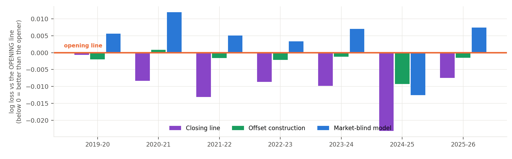

# NBA opening-spread walk-forward — model and strategy review

**Strategy:** Directional value-taking against the opening point spread in NBA
regular-season games. A market-blind margin model prices every listed game; its
disagreement with the opening spread is then spent, at about a third of face
value, as a correction *to* the opening spread — `m_final = open_margin + f(x)`,
with `f` a ridge shrunk hard toward zero and fitted walk-forward. A single side is
taken where the corrected margin still disagrees with the line by more than a
walk-forward selected threshold, at the best number available across books. Every
position is one side of one game at −110, entered at the open and held to
settlement: no hedge, no offsetting leg, no in-game management, no exit. Flat 1
unit per bet, so nothing compounds. No calendar filter.

Selection is the strategy. The book is roughly 10% of the slate, so the cover rate
on the selected book is not the cover rate on the slate.

**Simulation:** 888 bets across 7 seasons, 2019-20 → 2025-26, on recorded opening
spreads. The configuration is selected on seasons 1..k from a pre-declared space,
frozen, scored on season k+1, and rolled forward; nothing is refitted on the
season being scored, and the selection history reaches back to 2012-13. Earlier
seasons are excluded from scoring on principle: the daily injury report begins
2018-12-17 and the availability leg is half the production margin, so before
2019-20 the model cannot run as designed.

## Headline results

| season | books/game at open | bets | P&L (u) | ROI | Sharpe (ann.) |
|---|---|---|---|---|---|
| 2023-24 | 7.74 | 154 | +21.20u | +13.77% | 1.90 |
| 2024-25 | 1.00 | 210 | +50.40u | +24.00% | 3.81 |
| 2025-26 | 1.03 | 96 | +4.85u | +5.05% | 0.54 |
| **2023-26 pooled, best of 9 books** | — | **460** | **+76.44u** | **+16.62%** | **2.25** |
| 2023-26 pooled, after outlier haircut | — | 460 | +66.03u | +14.36% | — |
| 2019-26, all seven scored seasons | — | 888 | +80.93u | +9.11% | 1.10 |

ROI is P&L per unit staked. Sharpe is annualized by √(sessions per season), not
√252, which would inflate it 1.8×. Prices are the best of 9 books, but that panel
is measured only in 2023-24, so the multi-book figures are modelled for every
other season. The haircut row charges for the 8.1% of best-of-N prices that sit
more than 1.5 points off the next book. The last row is the full scored frame and
is the honest denominator: the three-season block is the recent end of it, not a
separate result.


*All 888 bets in date order at the opening spread and −110; flat 1u, so the path
is a running sum and nothing is re-selected within it. Trough is −23.1u at bet
161. The first three seasons lose money; the last four make +83.5u.*

Pooled over the three recent seasons ROI is +16.62% with a season-clustered 95%
interval of [−9.29%, +37.83%]; over all seven it is +9.11% with an interval of
[−2.75%, +16.08%] and an MDE80 of 12.7pp. **Both intervals contain zero.** In the
three-season block 2024-25 alone supplies 66% of the P&L.

The frame is also too short to tune on. Measured, a null taking the best of five
randomly chosen game subsets buys +2.54 ROI points on average, and every strategy
filter tested lands inside that band. Shortening the window does not escape this:
across all contiguous windows the best 3-season window returns +16.95% against a
+9.03% average, and the best 4-season window +14.92% against +9.33% — so roughly
+5.6 to +7.9 of any short-window headline is the selection rather than a regime.
The full seven-season frame is the only window whose selection cost is zero by
construction.

## The model

The model outputs a margin, not a probability. A spread is itself a margin
forecast, so the sides test involves no devig or probability conversion.

```
margin = 0.5·four_factors + 0.5·availability_composition + schedule_layer + tank_term
P(home win) = sigmoid(margin / 7.2)
```

Two independent estimates of team strength, averaged, plus additive context. The
market-blind model never sees market odds, enforced structurally rather than by
convention; only the offset layer above it sees the price.

| component | what it is | how it is fit |
|---|---|---|
| Four factors | opponent-adjusted ratings on shooting, turnovers, rebounding and free-throw rate; a decomposition of points per possession rather than a feature shortlist | one L2 ridge solve per factor (`ridge=25`), then the four adjusted values mapped to points by a fitted linear map. An 8-factor extension tied, so 4 is kept for parsimony |
| Availability composition | Σ over available players of DARKO talent × trailing minutes / 48; the leg that reacts to injuries | each player weighted by 1 − P(out), forecast from as-of-open information only. Requires the daily injury report; this is why the frame starts 2019-20 |
| Schedule layer | home edge, back-to-backs, dead-team flags | estimated walk-forward, EB shrinkage `n/(n+600)` toward a prior, `team_home_ridge=200` on per-team home deviations. The only component that has survived strict out-of-sample testing on every split tried |
| Tank term | late-season effort | exactly zero outside its window |
| Offset layer | the correction to the opening line | ridge on three features knowable at the open, shrunk hard toward zero. Fitted edge coefficient 0.33–0.37 in every fold |

## How it compares to the two market prices



Per-season log loss measured against the opening line, which is the zero line. Levels
differ by about 0.01 nats while each series own rolling path swings 0.30, so a
levels chart leaves all four overlapping and illegible; the differences are the
readable form. Pooled over 2019-26: opening line 0.60839,
closing line 0.59799, offset construction 0.60589, market-blind model 0.61217.

**The market-blind model is the only series above the opener.** It does not beat
the price it would transact at, and it is beaten decisively by the close. The
offset construction sits between the two prices, recovering 24.1% of the
open-to-close gap; the blind model recovers −36.4% of it, moving the wrong way.

This is the most useful negative result in the project, and the offset
construction does not make sense without it. The blind model is not a discarded
attempt — it is the offset layer's dominant input, and the finding that its
disagreement must be spent at a third of face value against a market anchor,
rather than trusted on its own, is the strategy.

## Bet-time information, and a leak that was found and closed

The availability leg was built on the 5PM injury report and the official pregame
inactive list. Both publish *after* the opening line the strategy transacts at, so
every open-priced figure produced before this was found gave the model
information the bettor did not have.

The exposure was measured rather than assumed. Comparing each team-day's out-set
to the previous published report: 81.9% of tonight's absences are already known,
18.1% are new on the day, 19.3% weighted by the absent player's minutes, and 44.3%
of team-days carry at least one late scratch. Rebuilding the out-set by
carry-forward from the last report strictly before game day widened the model's
gap to the market from 12.87% to 17.17% — **the late information was worth 33% of
the model's entire deficit.**

The fix does not accept the degraded hard out-set but forecasts it. Each rostered
player is now weighted by 1 − P(out), estimated from as-of-open information only.
Players last listed *Questionable* turn out to be out 28.9% of the time; the old
hard rule scored them 0.000 and was wrong in both directions. Gated against the
hard-rule incumbent with the specification hashed and the detectable effect stated
before the endpoint was read: season-clustered delta −0.002265, 95% interval
[−0.0041, −0.0004] excluding zero, better in 5 of 5 seasons, calibration veto
passed. It recovers 52% of the leakage penalty using only what is public at the
open.

The correction is also what separates the two architectures. Under honest inputs
the market-blind model's capture against the opener fell from +0.075 to −0.104 —
it flipped negative — while the offset construction fell only from +0.313 to
+0.267. Because the ridge already spent the model's edge at a third of face value,
it was never leaning on the contaminated signal.

## What would change the assessment

- **2026-27, scored prospectively.** The architecture was developed on 2021-26
  data, so no retrospective procedure can make it an untouched test. Both arms
  will run on identical games, with the market-blind arm as the live control.
- **Two books captured at the open, from opening night.** The multi-book logger
  has never run in-season. If it is down on opening night, that season's
  open-price record cannot be reconstructed afterwards.
- **More seasons.** Seven is the honest frame and it is not enough. Resolving an
  effect this size needs roughly 36 seasons at this dispersion.

## Notes and caveats

- Results are **simulated** on recorded opening prices with a walk-forward
  selection rule. No capital has ever been deployed.
- Multi-book pricing is measured in 2023-24 only (7.74 books/game) and modelled
  elsewhere; 2024-25 and 2025-26 observe 1.00 and 1.03 books per game at the open.
- Passive-fill and best-of-N assumptions are optimistic, exchange fees and account
  limits are not modelled, and competing flow is absent from the replay.
- Neither arm is the production default; promoting one is a re-certification.
- The full register of 211 decisions, most of them rejections — including four
  team-name join bugs, an availability leak, two wrong evaluation frames and a
  confidence interval that briefly claimed false significance — is in
  `docs/DECISIONS.md`.
