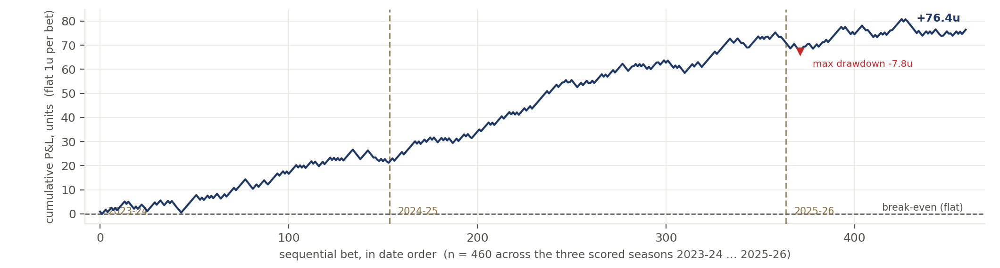
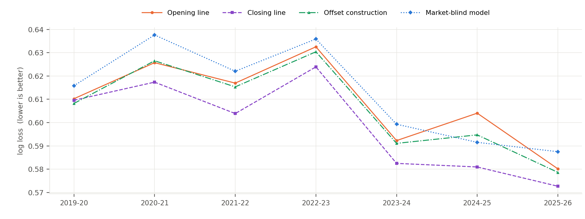

# NBA opening-spread walk-forward — model and strategy review

Code, data pipeline and the full research register: **github.com/sean-qin-usa/nba-prediction-model**

## Strategy

Directional value-taking against the opening point spread in NBA regular-season games. A market-blind margin model prices every listed game; its disagreement with the opening spread is then spent, at about a third of face value, as a correction *to* the opening spread. The architecture and its transformations are fixed ex ante. Within each walk-forward fold the team ratings, availability probabilities, schedule effects and offset coefficients are estimated exclusively from prior seasons:

```
m_offset = m_open + f( m_blind − m_open ,  rest differential ,  |m_open| )
```

where `f` is a ridge regression shrunk hard toward zero and refitted in each fold. Its coefficient on the fundamental disagreement `m_blind − m_open` lies in [0.33, 0.37] in every fold, so the model's stated edge is spent at roughly a third of face value. A single side is taken when the corrected margin still disagrees with the line by more than a walk-forward selected threshold, at the best number available across books. Every position is one side of one game at −110, entered at the open and held to settlement, with no hedge, offsetting leg, in-game management or exit. Each bet is a flat 1 unit, so returns do not compound, and no calendar filter is applied.

Selection is the strategy. The book below is 460 bets out of roughly 3,690 regular-season games in the window, about 12% of the slate. A side is taken only where the corrected margin disagrees with the opening spread by more than the walk-forward threshold, so the cover rate on the selected book is not the cover rate on the slate.

Simulation: 460 bets, 3 seasons, 2023-24 → 2025-26. The configuration is selected on seasons 1..k from a pre-declared space, frozen, scored on season k+1, and rolled forward; nothing is refitted on the season being scored. The selection history reaches back to 2012-13, so the three seasons here are scored against a decade of prior data rather than against each other. Results are reported at a modelled best-of-nine execution tier. That tier is observed directly in 2023-24, where the panel averages 7.74 books per game, and inferred from the measured shopping relationship in 2024-25 and 2025-26.

## Headline results

| season | books/game at open | bets | P&L (u) | ROI | Sharpe (ann.) |
|---|---|---|---|---|---|
| 2023-24 | 7.74 | 154 | +21.20u | +13.77% | 1.90 |
| 2024-25 | 1.00 | 210 | +50.40u | +24.00% | 3.81 |
| 2025-26 | 1.03 | 96 | +4.85u | +5.05% | 0.54 |
| **2023-26 pooled — recent execution headline** | **—** | **460** | **+76.44u** | **+16.62%** | **2.25** |
| **2019-26 — primary full-frame reference** | **—** | **888** | **+80.93u** | **+9.11%** | **1.10** |

ROI is P&L per unit staked; Sharpe is annualized on realised sessions. The multi-book panel is measured only in 2023-24, so the pooled figures are modelled for 2024-25 and 2025-26. The final row reports the full seven-season frame and serves as the primary reference; the three-season headline is the recent portion of that same sample.

Best-of-nine is the most consequential execution assumption in the headline. At a single observed book the same bets return +10.63%, so approximately two-thirds of the reported ROI survives with no line shopping at all; the full ladder appears under Execution below.



*All 460 bets in date order at the opening spread and −110; flat 1u, so the path is a running sum and nothing is re-selected within it. Max drawdown is −7.75u at bet 372. Over the full seven-season frame the path is +80.93u on 888 bets with a −23.1u drawdown, the first three of those seasons losing money and the last four making +83.5u.*

Pooled ROI is +16.62% over 460 bets, with a season-clustered 95% interval of [−9.29%, +37.83%]; on the full seven-season frame it is +9.11% with an interval of [−2.75%, +16.08%]. Three seasons is a small sample and both intervals contain zero. 2024-25 supplies 66% of the three-season P&L.


<!--PAGEBREAK-->

## The model

The model outputs a margin, not a probability. A spread is itself a margin forecast, so the sides test involves no devig or probability conversion.

```
margin = 0.5·four_factors + 0.5·availability_composition + schedule_layer + tank_term
P(home win) = sigmoid(margin / 7.2)
```

Two independent estimates of team strength, averaged, plus additive context. The market-blind model never sees market odds, enforced structurally rather than by convention. Only the offset layer above it sees the price.

| component | what it is | how it is fit |
|---|---|---|
| Four factors | opponent-adjusted ratings on shooting, turnovers, rebounding and free-throw rate; a decomposition of points per possession rather than a feature shortlist | one L2 ridge solve per factor (`ridge=25`), then the four adjusted values mapped to points by a fitted linear map. An 8-factor extension tied, so 4 is kept for parsimony. |
| Availability composition | Σ over available players of DARKO talent × trailing minutes / 48; the leg that reacts to injuries | each player weighted by 1 − P(out), forecast from information available at the open. Requires the daily injury report; this is why the model frame starts 2019-20 |
| Schedule layer | home edge, back-to-backs, dead-team flags | estimated walk-forward, EB shrinkage `n/(n+600)` toward a prior, `team_home_ridge=200` on per-team home deviations. The only component that has survived strict out-of-sample testing on every split tried. |
| Tank term | late-season effort | exactly zero outside its window |
| Offset layer | the correction applied to the opening line | ridge on three features knowable at the open, shrunk hard toward zero. Fitted edge coefficient 0.33–0.37 in every fold |

Regularisation, in four forms: L2 ridge on the ratings solve; empirical-Bayes shrinkage toward a prior in the schedule and tank layers; data augmentation via prior-season pseudo-observations; and Bayesian/EB priors in the usage and props fits. The link scale 7.2 is the frozen production constant. It is a plug-in rather than a tuned one — matching a logistic to the margin-residual normal gives 7.53 from training residuals alone, and re-deriving it inside each fold is worth about 0.0002 nats, not significant. Every log-loss comparison in this document recalibrates each source walk-forward on prior seasons, so no forecast is advantaged by another's scale.

Inputs are four, and all public: `nba_api` box scores, the daily NBA injury report (PDF ingest), DARKO talent ratings, and historical odds, the last used by the offset layer and for scoring but never by the market-blind model. The entire purchasable stack — professional minutes projections, tracking feeds and premium talent ratings — improves log loss by 0.0012 nats combined, an effect whose interval contains zero. Fitting is restricted to the `002` prefix, 35,546 regular-season games.

Player-, lineup- and matchup-level alternatives were built and gated rather than skipped — defensive RAPM, defended-FG% by shot category, Synergy play-types, a player skill posterior and 151,914 lineup stints among them. None improved significantly on the shipped DARKO-based availability composition, which is the one player-level term that survived. The full inventory and each gate result are in the repository.

**Accuracy.** All four forecasts are scored on identical games over the fully-covered frame (2019-20 → 2025-26, K=7, n=8,286), each converted to a probability with its own walk-forward scale.



*Log loss by season, all four forecasts on identical games. Lower is better.*

| pooled, 2019-26 (n=8,286) | opening line | closing line | offset construction | market-blind model |
|---|---|---|---|---|
| **log loss** | 0.6084 | **0.5980** | 0.6059 | 0.6122 |

The offset construction improves on the opening line in six of the seven scored seasons and recovers 24.1% of the information the market adds between the open and the close. The market-blind model does not improve on the opener, which is why the strategy is constructed as a correction to the line rather than as a forecast compared against it. Against the closing line its normalized gap — `(ll_us − ll_mkt) / (ln2 − ll_mkt)`, the share of the closing line's skill-above-a-coinflip left uncaptured — is 13.59%.

Closing-line value is positive and significant across 19 seasons, so the disagreement the offset layer acts on does carry information relative to the market's final price.

## Considerations

### Reporting frames

Two frames, each defined by what data exists. **Model accuracy:** 2019-20 → 2025-26 — the daily injury report the availability leg is built on begins 2018-12-17, so 2019-20 is the first fully covered season. **Betting:** the headline covers 2023-24 through 2025-26, the recent execution-study window. Multi-book prices are observed directly in 2023-24 and inferred in the two seasons after it, and the complete seven-season result is reported alongside it in the same table.

### Execution

Model held fixed and only the transacted price varied, on the 2023-26 book.

| execution | 2023-26 ROI | status |
|---|---|---|
| 1 retail book | +10.63% | single-book baseline |
| 2 books | +12.91% | measured in 2023-24 only |
| 5 books | +15.31% | firm baseline |
| **9 books** | **+16.62%** | **max books observed, the reported tier** |
| exchange, 2% commission | +14.72% | arithmetic, no exchange data held |

The ladder flattens fast: 36% of the time two books post the same number, so extra books duplicate rather than add.

### Methodology

- **Walk-forward selection.** The specification applied to season *k*+1 is chosen from a pre-declared space using seasons 1…*k* only, and is scored on *k*+1 alone.
- **Settlement-only fills.** Bets are entered at the recorded opening spread, priced at −110 and held to settlement; the simulation models no queue, partial fill or re-pricing.
- **Bet-time information only.** Availability is constructed from the last injury report published *before* game day, excluding both the 5PM report and the pregame inactive list, which post after the opening line.
- **Regular season only.** The sample is restricted to games carrying the `002` prefix. NBA Cup group-stage games are retained because they count in the standings, and a pre-registered difference-in-differences found no detectable effect on them (MDE 2.21 points).
- **Season-clustered inference,** checked across rolling-origin, leave-one-season-out, block-bootstrap and legacy splits, corrected for multiple comparisons across the running family.

### Caveats

- All reported results are simulated. The model is not in production and no capital has been committed.
- Best-of-nine pricing is observed in one season and inferred in two. A measured multi-book panel exists for 2023-24 alone, at 7.74 books per game, while 2024-25 and 2025-26 observe 1.00 and 1.03 respectively, so their prices come from a shopping relationship applied to a single recorded book.
- Best-of-*N* execution assumes every bet is placed at the most favourable quoted line. Those quotes are also the most exposed to limits or withdrawal: 8.1% sit more than 1.5 points off the next-best book. Charging for them costs approximately 2.3 ROI points, and that charge captures none of the staking limits or account restrictions that arrive sooner in practice.
- 2026-27 is the first genuinely out-of-sample season. The betting configuration is re-selected walk-forward, but the model architecture was chosen on a 2021-26 corpus and passed to every step as fixed.
- Exchange fees, state taxes and account limits are not modelled. Full method, gates and the register of rejected work are in the repository.

### Next steps

- **Capture at least two books at the open, beginning opening night.** Best-of-two raises CLV by roughly 49%, and taking the worse of the two erases nearly all of that gain. The logger has never run in-season, so if it is not live on opening night the season's open-price CLV record is lost and cannot be reconstructed afterwards.
- **Run both arms prospectively in 2026-27.** The offset construction is the primary and the market-blind model its live control. They share 65% of their bets and take the same side on every overlapping game, which makes the pairing a controlled comparison rather than a diversified portfolio.
- **Use CLV as the primary live diagnostic.** It is positive in 17 of 19 seasons, requires no de-vigging convention, and resolves within weeks, whereas realised ROI at this dispersion requires far more data than a season provides.
- **Evaluate exchange access if it becomes available.** It is the largest cost lever measured in this project and requires no further modelling change.
- **Prioritise the props engine over further sides research.** Both shipped improvements of the last development cycle came from props, and those markets appear less efficient.

Explicitly not next: further feature search on the sides model. The question the project turns on is whether live CLV against opening prices, with two books captured, reproduces the backtested relationship.
