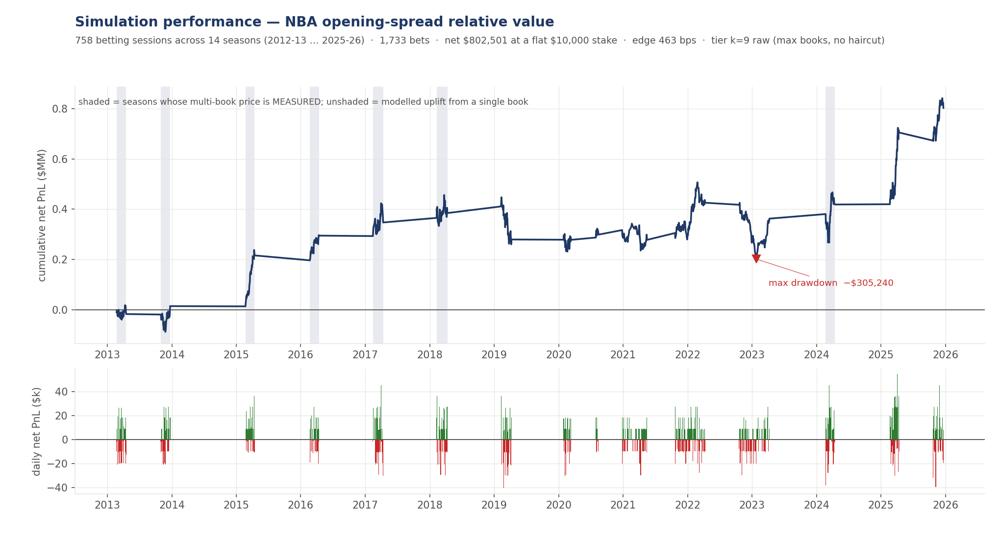

# Simulation performance — NBA opening-spread relative value

**Strategy:** Directional value-taking against the **opening** point spread in NBA
regular-season games, across all 30 franchises. A market-blind margin model
prices every game; a bet is placed only when the model's margin disagrees with
the opening spread by more than a walk-forward-selected threshold, and only in
the phase of the season the selected configuration is licensed for. Every
position is a single side of a single game at −110, held to settlement — there
is no hedge, no offsetting leg, and no intraday risk management. Positions are
US-book point spreads on listed NBA games.

**Simulation:** 758 betting sessions across 14 seasons, 2012-13 → 2025-26, on
recorded opening spreads with a multi-book best-price model. A **single fixed
selection procedure** is used across the entire window — the configuration is
chosen on seasons 1..k and scored on season k+1 only, never refitted on the
season being scored. Priced at **k=9 — the maximum number of distinct books
observed at the open** — with no outlier-realism haircut.

## Headline results

| window | days | net PnL | PnL/day | Sharpe (ann.) | win days | max drawdown | trades/day | staked ntl/day | edge (bps) |
|---|---|---|---|---|---|---|---|---|---|
| First half (2012-13 – 2018-19) | 302 | $279,761 | $926 | 0.4 | 45% | −$195,953 | 2.5 | $25k | 377 |
| Second half (2019-20 – 2025-26) | 456 | $522,740 | $1,146 | 0.7 | 48% | −$305,240 | 2.2 | $22k | 527 |
| **Full window** | **758** | **$802,501** | **$1,059** | **0.5** | **47%** | **−$305,240** | **2.3** | **$23k** | **463** |

Edge is net PnL per dollar of staked notional. Unlike a two-legged basis trade,
a spread bet has one leg, so notional is the stake and is not doubled. Dollar
figures are at a **flat, stated $10,000 per bet**; the strategy itself is
unit-denominated and does not size by confidence.

The first-half/second-half split shows the result is not driven by a single
sub-period, but note that **both halves are dominated by one season each** —
2014-15 in the first, 2024-25 in the second.

## Monthly breakdown

| month | days | net PnL | PnL/day | win days |
|---|---|---|---|---|
| October | 29 | $18,974 | $654 | 48% |
| November | 83 | $77,644 | $935 | 47% |
| December | 67 | −$127,073 | −$1,897 | 37% |
| January | 56 | $89,832 | $1,604 | 48% |
| February | 115 | $231,178 | $2,010 | 54% |
| March | 267 | $483,682 | $1,812 | 47% |
| April | 117 | −$13,756 | −$118 | 44% |

July, August and May sessions (24 days, +$42,020 combined) are the COVID-rescheduled
2019-20 and 2020-21 calendars and are folded into the totals but omitted above.

Month counts are unequal by construction: the walk-forward procedure selects a
*phase* as well as a threshold, and it repeatedly selects the back half of the
season, so March carries 267 of the 758 sessions.

## Per-season attribution (14 seasons)

Each line is one season's independently-scored book.

| season | net PnL | PnL/day | Sharpe (ann.) | win days | trades/day | staked ntl/day | edge (bps) |
|---|---|---|---|---|---|---|---|
| 2012-13 | −$16,488 | −$402 | −0.2 | 39% | 2.3 | $23k | −175 |
| 2013-14 | $31,549 | $717 | +0.4 | 41% | 2.2 | $22k | +322 |
| 2014-15 | $201,403 | $5,300 | +2.7 | 58% | 2.3 | $23k | +2,315 |
| 2015-16 | $78,658 | $2,126 | +1.1 | 51% | 1.9 | $19k | +1,140 |
| 2016-17 | $52,291 | $1,162 | +0.5 | 47% | 2.8 | $28k | +418 |
| 2017-18 | $37,346 | $718 | +0.3 | 42% | 2.5 | $25k | +292 |
| 2018-19 | −$104,998 | −$2,333 | −0.9 | 42% | 3.1 | $31k | −745 |
| 2019-20 | $19,269 | $410 | +0.2 | 47% | 2.4 | $24k | +171 |
| 2020-21 | −$20,820 | −$311 | −0.2 | 48% | 1.3 | $13k | −231 |
| 2021-22 | $147,526 | $1,317 | +1.2 | 48% | 1.6 | $16k | +843 |
| 2022-23 | −$63,109 | −$760 | −0.6 | 45% | 1.4 | $14k | −558 |
| 2023-24 | $56,187 | $1,171 | +0.5 | 42% | 3.7 | $37k | +314 |
| 2024-25 | $285,868 | $5,605 | +2.2 | 53% | 3.6 | $36k | +1,537 |
| 2025-26 | $97,819 | $2,038 | +0.9 | 56% | 2.8 | $28k | +725 |
| **ALL** | **$802,501** | **$1,059** | **0.5** | **47%** | **2.3** | **$23k** | **+463** |

**Ten of fourteen seasons are profitable; four are not.** Unlike a multi-tenor
book, these are sequential rather than concurrent, so they cannot diversify each
other — there is no portfolio effect and the aggregate Sharpe does not exceed the
best season. Season ROI dispersion is **8.23pp** (min −7.45%, max +23.15%), and
the season-clustered 95% confidence interval on pooled ROI is
**[−0.12%, +9.38%]** — it includes zero.

**Two seasons supply 61% of the net PnL** (2014-15 and 2024-25, $487k of $803k).

## Simulation methodology and assumptions

- **Walk-forward selection, no lookahead.** The configuration scored on season
  k+1 is chosen using only seasons 1..k. Nothing is refitted on the season being
  scored, and the selection rule and its search space were declared before
  scoring. Config changes 7 times across the 14 steps.
- **Settlement-only fills.** Every bet is priced at the recorded opening spread
  and held to game settlement at −110. There is no queue model, no partial fill,
  and no re-pricing — a spread bet either transacts at the posted number or does
  not exist.
- **Best-of-k execution.** The price used is the best of up to **9** distinct
  books at the open. Where fewer than 9 books are observed for a game, the best
  of those actually present is used; the tier is a ceiling, not a guarantee.
- **The model never sees market odds.** The margin model is market-blind. Only
  bet *selection* sees the price. This is enforced structurally, not by
  convention.
- **Regular season only.** Preseason, playoffs, All-Star weekend, play-in and the
  NBA Cup final are excluded by game-id prefix. NBA Cup group-stage games are
  included because they count in the standings; a pre-registered
  difference-in-differences found no detectable effect from them.
- **No market impact and no adverse selection.** Our bets do not move the posted
  number, and no book limits, voids, or re-prices us. At real size neither
  assumption holds — see caveats.

## Notes and caveats

- Results are **simulated** (historical replay against recorded opening prices),
  not live trading. No capital has ever been deployed on this strategy.
- **The headline execution tier is largely counterfactual, and this is the single
  largest caveat.** A genuine multi-book panel at the open exists for **7 of 14
  seasons**; in the other 7 the multi-book price is a **modelled uplift applied
  to a single observed book**. At the modern end this is stark: 2023-24 has a
  mean of **7.74 books per game** at the open, but 2024-25 has **1.00** and
  2025-26 has **1.03**. The k=9 figure is directly observed in essentially one
  season. Reassuringly, the measured seasons are not the weak ones — they return
  **+5.65%** against **+3.79%** on the extrapolated seasons — but the headline
  should be read as the ceiling of an execution capability we have not yet
  demonstrated we possess.
- **Going from 8 books to 9 is worth almost nothing** (+4.58% → +4.63%). The
  ladder is 1 book +1.83%, 2 books +2.82%, 5 books +3.96%, 8 books +4.58%,
  9 books +4.63%. Roughly **60% of the reported edge is execution rather than
  model** — the same bets at a single retail book return +1.83%.
- **The outlier-realism haircut is excluded from the headline by instruction.**
  Applying it — which charges for the 8.1% of best-of-N prices sitting >1.5
  points off the next book, precisely the prices that get limited or voided —
  takes the full window from **+4.63% to +3.65%** and cuts net PnL from $802k to
  $633k. That is the more realistic number.
- **Sharpe is 0.5, not 5.** It is annualised from daily net PnL over the ~54
  sessions this strategy actually trades per season. Using the conventional √252
  would report 1.2, which would be wrong: it assumes 252 independent trading days
  where there are 54. Neither figure is remotely institutional-grade.
- **Win days are 47%** — below half. The strategy is profitable because winning
  days are larger, not more frequent, which is the opposite of the profile a
  market-making book produces and implies materially fatter tails.
- **Max drawdown is $305,240 against $802,501 of net PnL** — 38% of everything
  ever made, and it occurs late in the window (2022-23), not early. Peak-to-
  recovery spans more than a season.
- **Edge of 463 bps is not comparable to a market-making edge.** It looks orders
  of magnitude larger than a basis book's sub-bps figure only because turnover is
  ~$23k/day rather than ~$1B/day. Per day, this strategy makes ~$1,059. The
  comparison flatters it meaninglessly.
- **Exchange access, not more books, is the remaining lever.** At 2% commission
  the same bets return **+5.58%** with a 95% interval of **[+1.15%, +10.56%]** —
  the only tier in the ladder whose interval excludes zero. We hold no exchange
  data; that row is arithmetic applied to executed-elsewhere bets.
- **The model's structure was selected on a 2021-26 corpus**, so it is era-fitted
  in a way the walk-forward loop does not correct. The first season on which the
  structure is genuinely out of sample is 2026-27.
- Exchange fees, state taxes, and account limits are not modelled.
- Sharpe is annualised from daily net PnL (√54, the realised session count).
