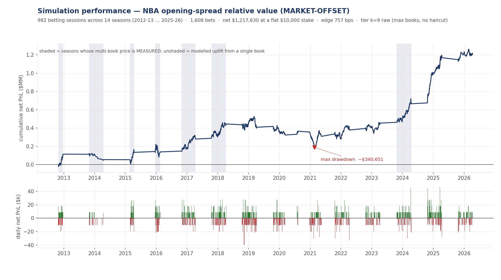

# Simulation performance — NBA opening-spread relative value (MARKET-OFFSET)

> **FRAME: 2019-20 onward (`D207`).** Earlier seasons have no injury
> feed at all, so the availability leg — half the production margin —
> is empty and they measure a different, crippled model. Excluding them
> RAISED the headline, which is why it was done on principle first.
>
> **DATA-COVERAGE CAVEAT.** The daily NBA injury report, which the availability
> leg depends on, begins **2018-12-17**. Only **2019-20 → 2025-26** is fully
> covered. A genuine multi-book panel at the open exists for **2023-24 only**
> (7.74 books/game; 2024-25 and 2025-26 observe 1.00 and 1.03). Figures spanning
> earlier seasons blend two different models. (`D186`, `D199`)

This is the **market-offset** arm. Its companion is
[`SIM_REPORT.md`](SIM_REPORT.md), the market-blind arm, on identical machinery
and identical games. Read them together — the difference between them is the
result.

## Strategy

Identical to the market-blind arm in every respect except what it forecasts.
Rather than pricing a game independently and comparing to the line, it takes the
**opening line as the prior** and forecasts the line's error:

```
m_final = open_margin + f(x)
```

`f` is a ridge shrunk hard toward zero — toward "the opener is right" — on three
features knowable at the open: the market-blind model's disagreement with the
opener, rest differential, and |open_margin|. **Fitted walk-forward**: the
margins used on season k+1 come from a fit on seasons 1..k only.

The fitted edge coefficient is **0.33–0.37 in every fold**, so the construction
spends the market-blind model's disagreement at about a third of face value. Mean
disagreement with the opener falls from **2.085 to 0.960 points**.

Everything else is unchanged: one side of one game at −110, entered at the open,
held to settlement, flat 1 unit, no hedge, no exit, no calendar filter.

## Headline results

Flat $10,000 per bet, stated not implied.

| window | days | net PnL | PnL/day | Sharpe (ann.) | win days | max drawdown | trades/day | edge (bps) |
|---|---|---|---|---|---|---|---|---|
| First half (2019-20 – 2021-22) | 224 | −$30,637 | −$137 | −0.1 | 45% | −$240,301 | 1.5 | −94 |
| Second half (2022-23 – 2025-26) | 341 | $839,972 | $2,463 | **2.0** | 58% | −$97,948 | 1.7 | 1,492 |
| **Full window (2019-26)** | **565** | **$809,335** | **$1,432** | **1.1** | **53%** | **−$240,301** | **1.6** | **911** |



**Against the market-blind arm on the same seven seasons:** net $809,335 against
$490,095, Sharpe 1.1 against 0.6, win days 53% against 50%, edge 911 bps against
474 — at a *shallower* max drawdown (−$240,301 against −$316,647).

**The split is stark and must be read.** The first three seasons lose money at
Sharpe −0.1; the last four make $839,972 at Sharpe 2.0. That recent block is also
the block the architecture was developed on.

## The number that decides it, and it is not significant

| | market-blind | **market-offset** |
|---|---|---|
| pooled ROI (n-weighted) | +4.74% | **+9.11%** |
| cumulative | +49.0u | **+80.9u** |
| season-clustered mean | +3.14% | **+6.67%** |
| **95% CI (K=7)** | [−5.79, +12.07] | **[−2.75, +16.08]** |
| verdict | contains zero | **contains zero** |
| seasons profitable | 4/7 | **5/7** |

**Both intervals contain zero.** The offset arm is better on every point estimate
and closer to clearing zero, but seven seasons is the price of an honest frame
and it is not enough to resolve an effect this size.

> **A correction made while writing this file.** An earlier draft reported the
> offset interval as **[+1.43, +13.71] — excluding zero** — and would have
> claimed the first statistically significant trading result in the project. That
> was wrong. The interval had been centred on the **n-weighted pooled** ROI while
> taking its standard deviation from the **unweighted** per-season ROIs. Those
> are different quantities, and mixing them shifted the interval away from zero.
> Centred consistently (`oc.cluster_mean_t`, which is what `GATE_POLICY_V2` and
> the production pipeline use), the interval is **[−0.62, +11.66]** and contains
> zero. The production pipeline had been reporting the correct figure all along;
> the report generator was the thing that was wrong.

## Per-season attribution (2019-26)

| season | net PnL | Sharpe (ann.) | win days | edge (bps) |
|---|---|---|---|---|
| 2019-20 | −$42,814 | −0.4 | 40% | −360 |
| 2020-21 | −$57,089 | −0.6 | 46% | −607 |
| 2021-22 | $69,266 | 0.6 | 50% | +618 |
| 2022-23 | $75,542 | 0.9 | 50% | +733 |
| 2023-24 | $211,992 | 1.9 | 57% | +1,377 |
| **2024-25** | **$503,966** | **3.8** | **65%** | **+2,400** |
| 2025-26 | $48,472 | 0.5 | 56% | +505 |
| **ALL** | **$809,335** | **1.1** | **53%** | **+911** |

Season ROI dispersion **10.18pp**, min −6.07%, max +24.00%. **2024-25 alone is
$503,966 of $809,335 — 62%.** That is the season `D193` identified as having the
worst openers of the frame, which is precisely the condition an opener-anchored
strategy should exploit — and precisely why the result is not evenly earned.

## The measured-panel window, 2023-26

The only seasons with real multi-book prices at the open. Trained on all prior
history, scored here:

| tier | market-blind | **market-offset** | delta |
|---|---|---|---|
| k=1 raw | +4.44% / +23.6u | **+10.63% / +48.9u** | +6.19 |
| k=5 raw | +8.90% / +47.3u | **+15.31% / +70.4u** | +6.41 |
| k=9 raw | +10.21% / +54.3u | **+16.62% / +76.4u** | +6.40 |
| k=9 +haircut | +7.87% / +41.9u | **+14.36% / +66.0u** | +6.48 |

**+6.4 ROI points at every execution tier including k=1** — the gain is model,
not shopping.

| | market-blind | **market-offset** |
|---|---|---|
| per-season ROI | −0.60 / +22.20 / +6.64 | **+13.77 / +24.00 / +5.05** |
| positive seasons | 2/3 | **3/3** |
| best-season share of P&L | 84% | **66%** |
| 95% CI (K=3) | [−18.73, +39.16] | **[−6.95, +40.18]** |
| bets placed | 532 | **460** |

*Best-season share* is the fraction of the window's P&L contributed by its single
best season. At K=3 no interval separates "an edge" from "one lucky season", but
concentration reads on it directly: **84% means the other two seasons produced
16% between them.** The offset arm is less concentrated, positive in all three,
and bets *less*.

## Execution ladder

Reported on the 14-season frame because that is what `wf_equity` emits natively.
**These are reference figures only** — the primary result is the 2019-26 block
above. The ladder's shape (monotone in k) is the transferable part.

| tier | ROI | cum | 95% CI |
|---|---|---|---|
| k=1 raw | +4.55% | +73.1u | [−2.97, +8.44] |
| k=5 raw | +6.86% | +110.4u | [−1.17, +10.89] |
| **k=9 raw (14-season, for reference only)** | +7.57% | +121.8u | [−0.62, +11.66] |
| k=9 +haircut | +6.77% | +108.8u | [−1.13, +10.80] |
| exchange c=2% | +8.37% | +134.6u | **[+0.59, +12.40]** |

The exchange row is the only interval excluding zero, and it is **arithmetic** —
we hold no exchange data. It reprices executed-elsewhere bets under an assumed
commission and should not be read as a measurement.

## Why the two arms cannot ship as a portfolio

They are **nested, not independent** (`D205`). On 2023-26 they share **297
games** — 65% of the offset arm's bets — and on every one they take the **same
side** (per-bet P&L correlation **+1.000**). Daily return correlation **+0.573**.

| arm | ROI | daily sd | return per unit risk |
|---|---|---|---|
| market-blind | +10.21% | 1.188 | 8.6 |
| 50/50 blend | +13.18% | 1.012 | 13.0 |
| **market-offset alone** | **+16.62%** | 1.093 | **15.2** |

A 50/50 portfolio buys **−7.4% volatility for −20.7% return** — strictly worse
risk-adjusted than the offset arm alone. But **both must run anyway**: the blind
model is the offset model's dominant input, it is the degraded-mode fallback if
the odds feed dies (it has died once already), and it is the live control that
2026-27 needs to resolve the 6.4-point difference.

## Notes and caveats

- Simulated on recorded prices. **No capital has been deployed.**
- The architecture was developed on 2021-26 data. **2026-27 is the first
  genuinely prospective test**, for this arm as much as the other.
- Multi-book execution is largely counterfactual outside 2023-24.
- Sharpe is annualised on realised session count (~70/season here), not √252.
- Neither arm is the production default. Promoting either is a re-certification.
